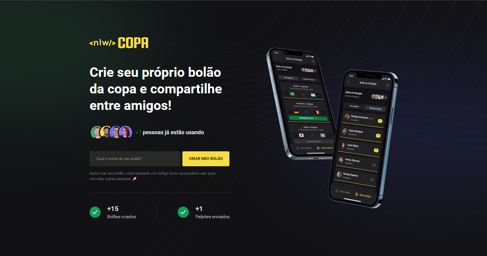

## Aplicação frontend WEB desenvolvida no evento NLW 10 - Copa

#### Ferramentas
1) NextJS 
   - Framework Javascript criado a partir da biblioteca React, inicialmente desenvolvida pelo Facebook e atualmente OpenSource mantida pela comunidade, é um dos frameworks javascript mais usados atualmente.
  
2) TailwindCSS
   - Framework CSS que permite estilizar aplicações web com agilidade por meio da aplicação de estilos inline.

### Home

